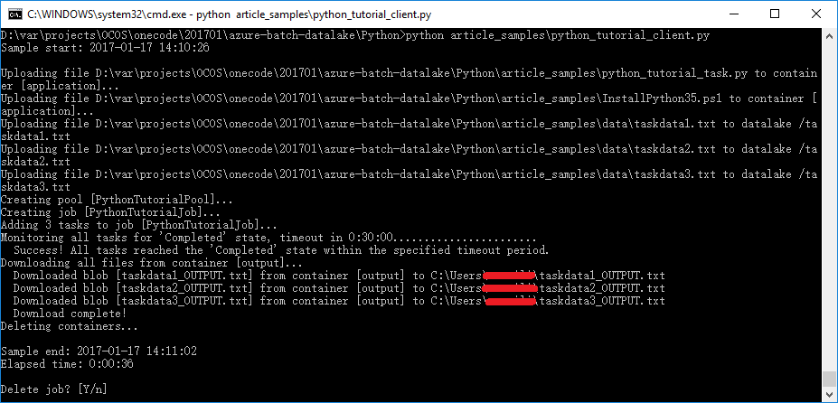

# Create Azure Batch PaaS Cloud Service by Python

## Introduction

A get-started Azure Batch sample written in Python, using Cloud Service Configuration for computing nodes in Batch pool and using Data Lake Service.
<br/>
<br/>
<br/>

## Prerequisites

*__Python Tools for Visual Studio__*

Install Python Tools for Visual Studio.

http://aka.ms/ptvs
<br/>
<br/>

*__Python SDK__*

Python Recommend the latest 3.5.2 version

https://www.python.org/downloads/
<br/>
<br/>

*__Azure Storage and Azure Batch Python packages__*

Install packages with the below commands in cmd.

```
cd /d <The sample directory containing vs solution>
python -m pip install -r requirements.txt
```

*__Azure Batch account__*

Once you have an Azure subscription, create an Azure Batch account.

https://docs.microsoft.com/en-us/azure/batch/batch-account-create-portal

*__Azure Storage account__*

Create an Azure Storage account.

https://docs.microsoft.com/en-us/azure/storage/storage-create-storage-account#create-a-storage-account


*__Azure Data Lake Store__*

Create an Azure Azure Data Lake Store account.

https://docs.microsoft.com/en-us/azure/data-lake-store/data-lake-store-get-started-portal#create-an-azure-data-lake-store-account


*__Azure AD Application__*

Create an Azure AD Application and grant privilege to Data Lake Store.

https://docs.microsoft.com/en-us/azure/data-lake-store/data-lake-store-authenticate-using-active-directory

*__Azure Tenant Id__*

Get Azure Tenant Id.

https://blogs.technet.microsoft.com/heyscriptingguy/2013/12/31/get-windows-azure-active-directory-tenant-id-in-windows-powershell/

## Build the Sample

Prepare the information at below from Azure portal.

*__A batch account__*

- The batch account name
- The batch account key
- The batch account URL

*__A storage account__*

- The storage account name
- storage account key

*__Azure Tenant Id__*

- The Azure Tenant Id

*__A Azure Data Lake account__*

- The Azure Data Lake name

*__A Azure AD Application__*

- The Azure AD Application Id
- The Azure AD Application Key

Replace the following properties in file python_tutorial_client.py with your actual values:

`_BATCH_ACCOUNT_NAME = ''`

`_BATCH_ACCOUNT_KEY = ''`

`_BATCH_ACCOUNT_URL = ''`

`_STORAGE_ACCOUNT_NAME = ''`

`_STORAGE_ACCOUNT_KEY = ''`

Replace the following properties in both python_tutorial_client.py and python_tutorial_task.py with your actual values:

`_DATALAKE_NAME = ''`

`_TENANT_ID = ''`

`_AAD_APPLICATION_ID = ''`

`_AAD_APPLICATION_KEY = ''`

## Running the Sample

Execute python_tutorial_client.py and see the output displayed as below.


